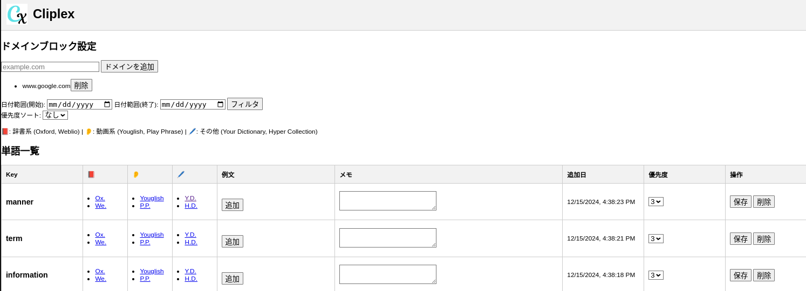

<p align="center">
  
</p>

<h1 align="center">📖 ClipLex</h1>

<p align="center">
  効率的な英単語学習をサポートするChrome拡張機能
</p>

<p align="center">
  <a href="https://developer.chrome.com/docs/extensions/get-started" target="_blank">
    
  </a>
  <a href="https://www.typescriptlang.org/" target="_blank">
    
  </a>
</p>

## 🌟 機能概要

ClipLexは、ウェブ上で選択したテキストを英単語として保存し、効率的に語彙力を向上させるChrome拡張機能です。以下のような特徴があります:

- 📚 単語保存: ウェブ上で選択した英単語をワンクリックで保存。
- 🔍 学習サポート: 辞書リンクや例文を通じて深い理解を提供。
- ✂️ ドメインブロック: 学習対象外のサイトを簡単に除外。
- 🗂️ カスタマイズ可能な優先度設定とメモ機能。

## 🚀 インストール方法

1. 必要な依存パッケージをインストール:
   ```bash
   npm install
   ```

2. ビルドを実行:
   ```bash
   npm run build
   ```

3. Chromeの拡張機能画面 (`chrome://extensions/`) を開き、「パッケージ化されていない拡張機能を読み込む」から `dist` フォルダを選択。

## 🛠️ 使い方

1. ウェブページ上で単語を選択。
2. 表示される保存ボタンをクリックして単語を保存。
3. 拡張機能の設定ページで保存した単語を管理。

## 📷 スクリーンショット

オプション画面で単語の復習や学習を行うことができます:
<p align="center">
  
</p>

## 🔧 設定オプション

| オプション名       | 説明                                     |
| ------------------ | ---------------------------------------- |
| 除外ドメイン設定   | 学習対象外にするドメインを簡単に設定。       |
| フィルタリング      | 追加日で単語を絞り込み。             |
| ページネーション    | 大量の単語をページごとに管理。               |

## 📂 ファイル構成

```
cliplex/
├── src/
│   ├── background.ts       # バックグラウンドスクリプト
│   ├── content_script.ts   # コンテンツスクリプト
│   ├── database.ts         # ローカルストレージ管理
│   ├── manifest.json       # Chrome拡張のマニフェスト
│   ├── options/            # 設定ページ
│   │   ├── options.html
│   │   └── options.ts
│   ├── types/              # TypeScript型定義
│   │   └── types.d.ts
│   └── ui/                 # アイコンやスタイル
├── dist/                   # ビルド結果
├── webpack.config.js       # Webpack設定
├── tsconfig.json           # TypeScript設定
├── package.json            # パッケージ情報
└── README.md               # ドキュメント
```

## 🖌️ アイコンについて

- **デザインツール**: [Canva](https://www.canva.com/)
- **フォント**: Magnolia Script  
  - [フォント情報はこちら](https://online-fonts.com/fonts/magnolia-script)
- Canvaデザインに関する著作権情報は[こちら](https://www.canva.com/en/help/copyright-design-ownership/)をご覧ください。

## 📚 参考文献

- [Extensions / Get started  |  Chrome for Developers](https://developer.chrome.com/docs/extensions/get-started)
- [マニフェスト ファイル形式  |  Manifest  |  Chrome for Developers](https://developer.chrome.com/docs/extensions/reference/manifest?hl=ja)
  - permissions: [権限  |  Permissions  |  Chrome for Developers](https://developer.chrome.com/docs/extensions/reference/permissions-list?hl=ja)
  - content_scripts: [コンテンツ スクリプト  |  Chrome Extensions  |  Chrome for Developers](https://developer.chrome.com/docs/extensions/develop/concepts/content-scripts?hl=ja)
  - option_page: [ユーザーに選択肢を提供する  |  Chrome Extensions  |  Chrome for Developers](https://developer.chrome.com/docs/extensions/develop/ui/options-page?hl=ja)
  - action: [chrome.action  |  API  |  Chrome for Developers](https://developer.chrome.com/docs/extensions/reference/api/action?hl=ja)

## 🧑‍💻 開発者向け

以下のスクリプトを活用してコード品質を維持:

- コードの整形: `npm run format`
- E2Eテストのコード作成: `npx playwright codegen https://makinzm.github.io/rust-wasm-github/`

---

<p align="center">💡 あなたの語彙力を飛躍的に向上させるツール「ClipLex」をぜひお試しください！</p>

